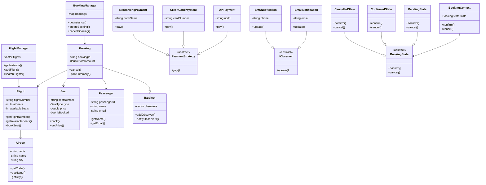

# ✈️ Airline Reservation System

A C++ Low Level Design (LLD) project implementing a fully functional Airline Reservation System with an interactive CLI, core OOP principles and design patterns.

## 📌 Features

- Interactive CLI menu for complete booking flow
- Search flights by origin and destination
- Book seats (Economy, Business, First Class)
- Auto-generated booking IDs
- Multiple payment methods (UPI, Credit Card, Net Banking)
- Automatic Email & SMS notifications on booking events
- Booking state management (Pending → Confirmed → Cancelled)
- Cancel bookings with instant notifications

## 🖥️ CLI Demo
```
----------------------------------------
   AIRLINE RESERVATION SYSTEM
----------------------------------------
  1. View all flights
  2. Search flights
  3. Book a seat
  4. View all bookings
  5. Cancel a booking
  6. Exit
----------------------------------------
  Enter choice:
```

## 🏗️ Design Patterns Used

| Pattern | Where Used |
|---|---|
| **Singleton** | FlightManager, BookingManager |
| **Strategy** | Payment methods (UPI, Credit Card, Net Banking) |
| **Observer** | Email & SMS notifications on booking events |
| **State** | Booking status transitions (Pending → Confirmed → Cancelled) |

## 📐 OOP Principles Applied

- **Encapsulation** — All class data is private, accessed via getters/setters
- **Inheritance** — Payment strategies, notification types inherit from abstract bases
- **Polymorphism** — Same `pay()` and `update()` calls behave differently per object
- **Abstraction** — `PaymentStrategy`, `IObserver`, `BookingState` define clean interfaces
- **SOLID Principles** — Each class has one responsibility, open for extension

## 📁 Project Structure
```
AirlineReservationSystem/
├── include/
│   ├── Airport.h
│   ├── Flight.h
│   ├── Seat.h
│   ├── Passenger.h
│   ├── Booking.h
│   ├── FlightManager.h
│   ├── BookingManager.h
│   ├── PaymentStrategy.h
│   ├── UPIPayment.h
│   ├── CreditCardPayment.h
│   ├── NetBankingPayment.h
│   ├── IObserver.h
│   ├── ISubject.h
│   ├── EmailNotification.h
│   ├── SMSNotification.h
│   ├── BookingState.h
│   ├── BookingContext.h
│   ├── PendingState.h
│   ├── ConfirmedState.h
│   └── CancelledState.h
├── src/
│   ├── Airport.cpp
│   ├── Flight.cpp
│   ├── Seat.cpp
│   ├── Passenger.cpp
│   ├── Booking.cpp
│   ├── FlightManager.cpp
│   ├── BookingManager.cpp
│   ├── UPIPayment.cpp
│   ├── CreditCardPayment.cpp
│   ├── NetBankingPayment.cpp
│   ├── EmailNotification.cpp
│   ├── SMSNotification.cpp
│   ├── PendingState.cpp
│   ├── ConfirmedState.cpp
│   ├── CancelledState.cpp
│   └── BookingContext.cpp
├── docs/
│   └── ARCHITECTURE.md
├── main.cpp
└── README.md
```

## ⚙️ How to Run

### Prerequisites
- g++ compiler (MinGW on Windows / g++ on Linux/Mac)

### Compile
```bash
g++ main.cpp src/Airport.cpp src/Flight.cpp src/Seat.cpp src/Passenger.cpp src/Booking.cpp src/FlightManager.cpp src/BookingManager.cpp src/UPIPayment.cpp src/CreditCardPayment.cpp src/NetBankingPayment.cpp src/EmailNotification.cpp src/SMSNotification.cpp src/PendingState.cpp src/ConfirmedState.cpp src/CancelledState.cpp src/BookingContext.cpp -I include -o program
```

### Run
```bash
./program      # Linux/Mac
.\program.exe  # Windows
```

## 📊 Sample Output
```
========== PROCESSING PAYMENTS ==========
Processing UPI payment of Rs.15000 from UPI ID: akshath@upi
UPI Payment Successful!

========== CANCELLING BOOKING BK001 ==========
[EMAIL to akshath@gmail.com]
  Event   : BOOKING CANCELLED
  Details : Booking BK001 for flight AI101 has been cancelled.
[SMS to 9999999999]
  Event   : BOOKING CANCELLED
  Details : Booking BK001 for flight AI101 has been cancelled.
```
## 📊 UML Class Diagram


## 🧠 Concepts Covered

- Classes & Objects
- Encapsulation, Inheritance, Polymorphism
- Abstract Classes & Interfaces
- Design Patterns: Singleton, Strategy, Observer, State
- Memory Management (new/delete)
- STL: vector, map
- Object Composition
- SOLID Principles

## 👨‍💻 Author

Aditya Jakkula — [github.com/Adityajakkula7](https://github.com/Adityajakkula7)